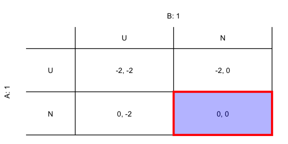

<!-- README.md is generated from README.Rmd. Please edit that file -->

# nitratesgame

<!-- badges: start -->

[](https://travis-ci.com/gopalpenny/nitratesgame)
[](https://codecov.io/gh/gopalpenny/nitratesgame?branch=master)
<!-- badges: end -->

The goal of nitratesgame is to provide a simple framework for analyzing
a game theoretic model of community nitrate contamination. It offers two
main tools for analysis:

1.  A tool for generating payout structures and solutions for 2x2 games
2.  A groundwater model for generating *simple* estimates of the
    probability of contamination for a well that sits within a grid of
    households in a neighborhood.

## Installation

You can install the development version from
[GitHub](https://github.com/) with:

``` r
# install.packages("devtools")
devtools::install_github("gopalpenny/nitratesgame")
```

## More information

The website for `nitratesgame` can be found on
[github.io](https://gopalpenny.github.io/nitratesgame/).

## 2x2 games (Example)

This is a basic example which shows you how to visualize a 2x2 game:

``` r
library(nitratesgame)

# tA: player type A
# tB: player type B
# Cs: cost of upgrading septic system
# Cd: cost of contamination
payouts <- get_2x2_payouts(tA = 1, tB = 1, Cs = 2, Cd = 3)
get_2x2_ggplot(payouts, TRUE)
```



## Groundwater model

See the vignettes for background and details about using the groundwater
model.
